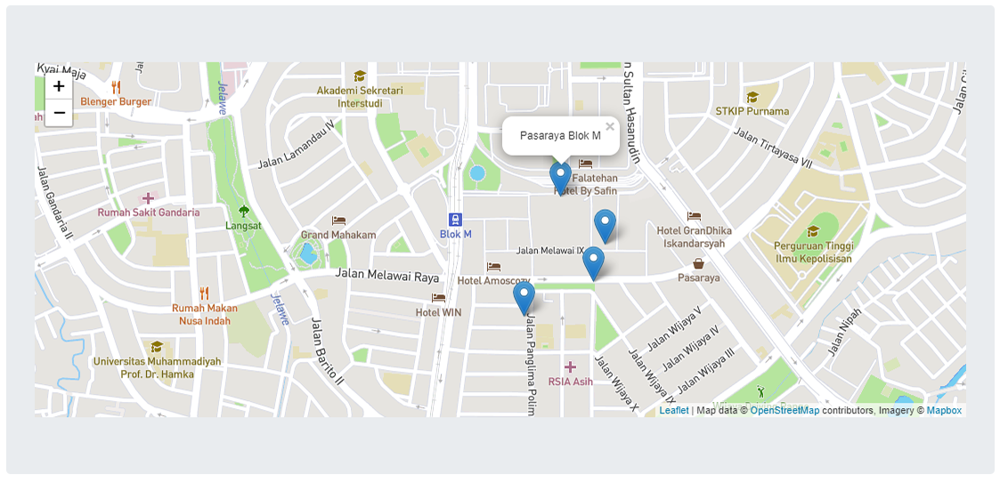

# Leafletjs Maps Expressjs

Jalankan perintah `npm install` untuk menginstall dependensi yang dibutuhkan. Kemudian jalankan perintah `node server.js` untuk menjalankan program.

### Screenshot
Maps dengan marker:

Popup informasi marker:
